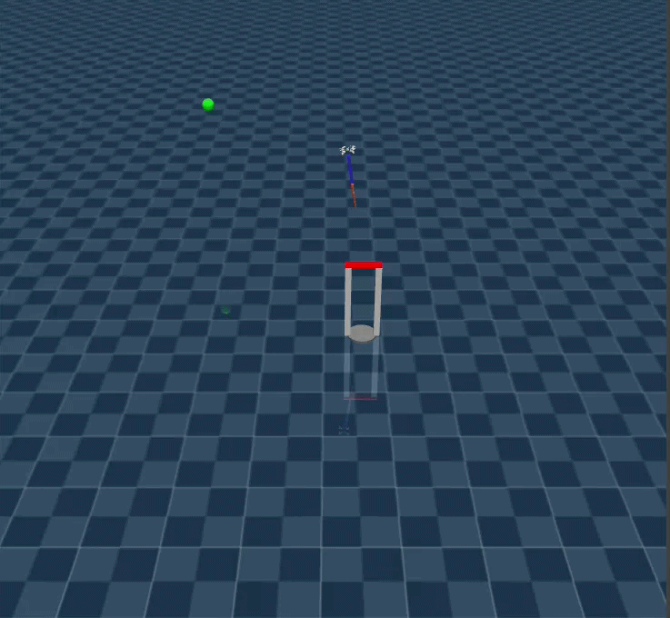

## Package Transportation Using Curriculum Reinforcement Learning with a Quadcopter-Mounted Spiral Robot Manipulator


The purpose of this repository is to implement and investigate the control and capabilities of a spiral robot system mounted on a quadcopter. The main objective is to solve a package delivery task using **reinforcement learning (RL)** enhanced with **curriculum learning**.

This repository is a direct extension of the [MuJoCo Drones Gym](https://github.com/tau-intelligence/MuJoCo-drones-gym) repository. Therefore, it contains the same environments, task definitions, and utilities as the original repository.

For this reason, this document focuses exclusively on the **modifications and extensions** introduced in this repository that distinguish it from the original implementation.




## About the Robot

The robot was inspired by the concept of **spiral robots** presented in [10.1016/j.device.2024.100646](https://doi.org/10.1016/j.device.2024.100646). In this implementation, a simplified **two-dimensional version** of the spiral robot is simulated, without modeling the elastic layer.

The manipulator is mounted underneath a **quadcopter based on the Bumblebee platform**.


## About the Tasks

Five different tasks were implemented, with **curriculum learning** applied where appropriate.

### `AdaptiveHookHover`

The agent starts from the initial position `(0, 0, 0.2)` and has to take off and stabilize at a randomly sampled target position of the form `(0, 0, z)`, where `z` is uniformly sampled from `[0.8, 2.0]`. During the task, the spiral robot manipulator performs random actions.

**Curriculum:** Initially, the agent only has to learn how to stabilize at the target position. Once this has been successfully learned, random actions are introduced on the manipulator, requiring the agent to maintain stability despite the disturbances caused by the manipulator.

### `AdaptiveFlyThroughAviary`

The agent has to navigate through `N` randomly sampled waypoints starting from the initial position. The waypoint coordinates are sampled uniformly from the following ranges:

- `x ∈ [-1, 1]`
- `y ∈ [-1, 1]`
- `z ∈ [0.4, 0.8]`

**Curriculum:** No curriculum learning is applied. This task primarily serves as a control environment to verify that the agent is capable of learning waypoint navigation.

### `AdaptiveVelocityAviary`

The agent has to track a randomly sampled velocity reference while maintaining a yaw orientation of `0` radians. The reference velocity is given by `(v_x, v_y, v_z)`, with:

- `v_x ∈ [-0.5, 0.5]`
- `v_y ∈ [-0.5, 0.5]`
- `v_z ∈ [-0.5, 0.5]`

**Curriculum:** Once the agent is able to reliably track the reference velocity, it is trained on scenarios in which a physical drone-payload connection is established. The agent must then continue to track the reference velocity while carrying the payload.

### `AdaptiveTransportAviary`

The agent has to navigate to a randomly positioned payload and transport it to a randomly positioned target location.

**Curriculum:** Initially, the agent only has to navigate through the required waypoints without interacting with the payload. Once this behavior has been learned, the agent must navigate to the waypoints while establishing physical contact with the payload and subsequently transport it to the final destination.

In addition to the task progression, the payload parameters are randomized during training, including:

- the radius of the cylindrical payload,
- the height of the cylindrical payload,
- the mass of the payload,
- the variance of the target position distribution.


### `AdaptiveTransportDirectorAviary`

This task is based on the same transport scenario as `AdaptiveTransportAviary`, but uses a hierarchical control architecture.

Instead of directly controlling the drone, the `AdaptiveTransportDirectorAviary` agent outputs a **velocity reference vector**, which is passed to a previously trained `AdaptiveVelocityAviary` agent.

In this setup:

- `AdaptiveTransportDirectorAviary` acts as a **high-level trajectory planner**.
- `AdaptiveVelocityAviary` acts as a **low-level controller**, responsible for tracking the velocity reference generated by the high-level agent.

This hierarchical architecture separates trajectory planning from low-level velocity control, allowing the two agents to focus on different levels of the control problem.


## Environments

| Environment | Obs Dim. | Action | Description |
|---|---:|---|---|
| `AdaptiveHookHover` | 17 | 4 + 2 | Hover at a randomly sampled target height. |
| `AdaptiveFlyThroughAviary` | 23 | 4 + 2 | Navigate through a sequence of randomly sampled waypoints. |
| `AdaptiveVelocityAviary` | 15 | 4 + 2 | Track randomly sampled velocity commands while maintaining the desired yaw orientation. |
| `AdaptiveTransportAviary` | 35 | 4 + 2 | Transport a package from a randomly positioned location to a randomly positioned target location. |
| `AdaptiveTransportDirectorAviary` | 35 | 4 + 2  | High-level trajectory planning using velocity commands that are passed to an `AdaptiveVelocityAviary` agent. |

### Observation Space

The observations are composed of the following state components:

- **`AdaptiveHookHover`**: `pos(3) + rpy(3) + vel(3) + ang_vel(3) + rel_goal(3) + tendon_lengths(2)` → **17**
- **`AdaptiveFlyThroughAviary`**: `pos(3) + rpy(3) + vel(3) + ang_vel(3) + next_waypoint(3) + rel_waypoint(3) + tendon_lengths(2)` → **20**
- **`AdaptiveVelocityAviary`**: `rpy(3) + vel(3) + ang_vel(3) + target_vel(3) + target_yaw(1) + tendon_lengths(2)` → **15**
- **`AdaptiveTransportAviary`**: `pos(3) + rpy(3) + vel(3) + ang_vel(3) + rel_wp(3) + rel_grab(18) + tendon_lengths(2)` → **35**
- **`AdaptiveTransportDirectorAviary`**: `pos(3) + rpy(3) + vel(3) + ang_vel(3) + rel_wp(3) + rel_grab(18) + tendon_lengths(2)` → **35**

### Action Space

- **`AdaptiveHookHover`**: `normalized_RPM(4) + tendon_length(2)` → **6**
- **`AdaptiveFlyThroughAviary`**: `normalized_RPM(4) + tendon_length(2)` → **6**
- **`AdaptiveVelocityAviary`**: `normalized_RPM(4) + tendon_length(2)` → **6**
- **`AdaptiveTransportAviary`**: `normalized_RPM(4) + tendon_length(2)` → **6**
- **`AdaptiveTransportDirectorAviary`**: `velocity(3) + yaw(1) + tendon_length(2)` → **6**


## Installation

```bash
git clone <this-repo>
cd multi_drone_mujoco/
pip install -e .          # core
pip install -e ".[all]"   # with RL, MARL, and visualization extras
```

## Requirements
- Python ≥ 3.8
- MuJoCo ≥ 3.0
- Gymnasium ≥ 0.29
- NumPy ≥ 1.21

## Usage

The main function for testing the learned algorithm is the `play` function located in `utilities/play.py`.

For example:

```bash
python3 utilities/play.py \
    --model_path=./Adaptive-hook-drone/final/rl_adaptive_director_curriculum/final_model.zip \
    --env_type adaptive_director \
    --episode 10 \
    --curriculum_flag True
```
## Project Structure

The project structure is largely the same as in the original repository, with the addition of the **quadcopter-mounted spiral robot system** and the specifically implemented task environments.
```
multi_drone_mujoco/
├── envs/
│   ├── adaptive_hook_hover.py    
│   ├── adaptive_hook_fly_thorugh.py
│   ├── adaptive_hook_velocity.py 
│   ├── adaptive_hook_director_velocity.py 
│   ├── base_aviary.py          # Core physics engine + Gymnasium env
│   ├── hover_aviary.py         # Single-drone hover task
│   ├── velocity_aviary.py      # Velocity tracking task
│   ├── multi_hover_aviary.py   # Multi-drone hover
│   ├── fly_through_aviary.py   # Waypoint navigation
│   ├── formation_aviary.py     # Formation flying
│   ├── race_aviary.py          # Gate racing
│   └── multi_agent_aviary.py   # PettingZoo wrapper
├── control/
│   ├── pid_control.py          # Cascaded PID controller
│   └── dsl_pid_control.py      # Enhanced PID with anti-windup
├── utils/
│   ├── enums.py                # DroneModel, Physics, ActionType, etc.
│   └── logger.py               # CSV logging + matplotlib plotting
├── examples/
│   ├── pid.py                  # PID control demos
│   ├── downwash.py             # Downwash visualization
│   ├── learn.py                # SB3 PPO training
│   └── play.py                 # Trained model playback
├── tests/
│   ├── test_envs.py            # Environment tests
│   ├── test_control.py         # Controller tests
│   └── test_multi_agent.py     # MARL tests
└── setup.py
```

